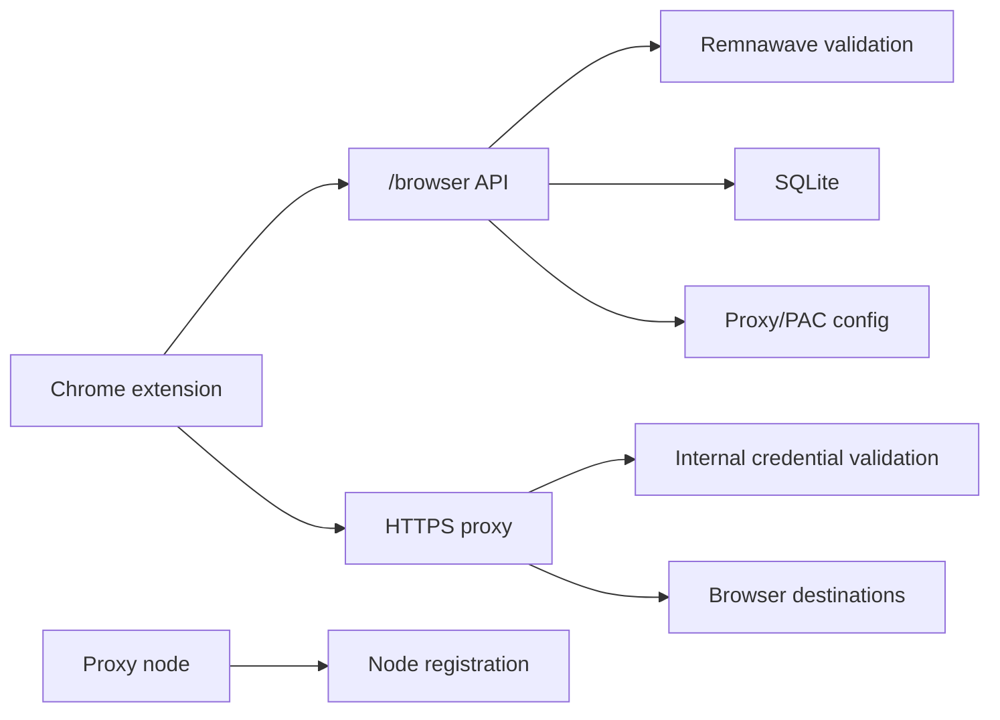

# Architecture

This repository contains the VLF Chrome Proxy backend MVP: a Go API, HTTPS proxy daemon, admin CLI and deployment scripts.

A formal independent third-party security audit has not yet been completed.

## Main Components

- `backend/cmd/api`: browser/session API.
- `backend/cmd/https-proxyd`: HTTPS proxy service for Chrome.
- `backend/cmd/admin`: local admin CLI for test access links.
- `backend/internal/remna`: Remnawave subscription validation.
- `backend/internal/httpapi`: HTTP routes and auth middleware.
- `backend/internal/service`: access/session/proxy credential logic.
- `deploy/`: runtime data, node config templates and Ubuntu installer.
- `configs/`: node config templates.

## Data Flow

## Security Boundaries

- Extension/API boundary using bearer browser session tokens.
- API/Remnawave boundary for subscription validation.
- HTTPS proxy boundary using Basic proxy credentials.
- Central/proxy-node boundary using node registration token.
- SQLite database boundary storing token hashes and session metadata.
- TLS private key boundary for proxy nodes.

## Runtime Overview

Docker Compose can run API, HTTPS proxy and admin CLI profiles. The system supports central and proxy-node roles. Proxy nodes can register with a central backend and validate credentials through internal endpoints.

## Known Limitations

- Formal external audit is not completed yet.
- Immediate Remnawave revocation at every proxy auth challenge is intentionally avoided; local TTLs and session revalidation are used.
- TLS key and node registration token handling depend on deployment hygiene.
- Retention policy is not defined in code.
